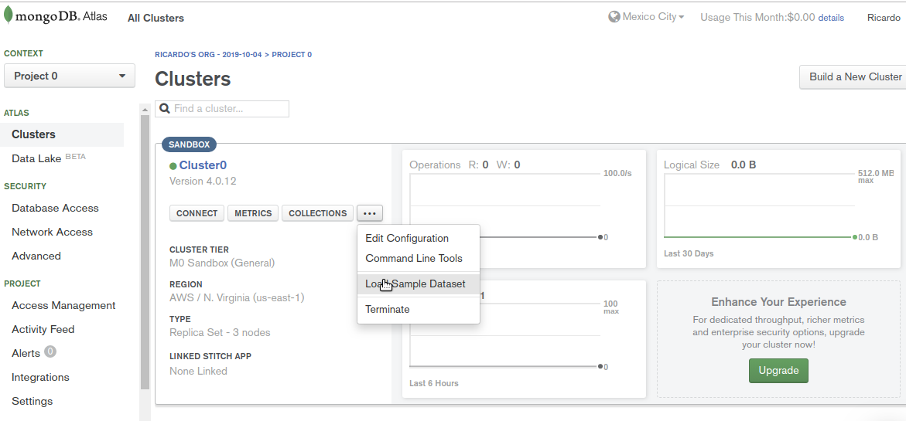
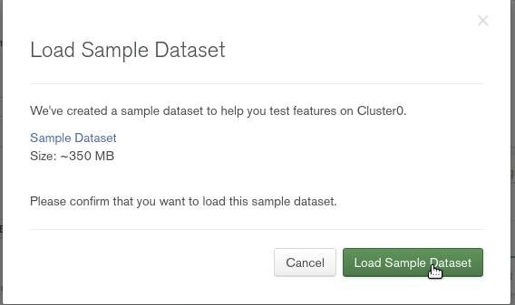
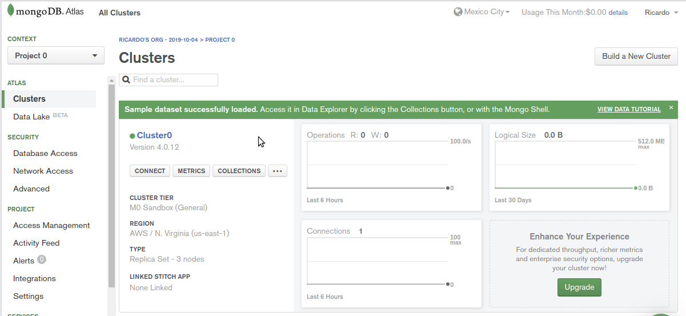
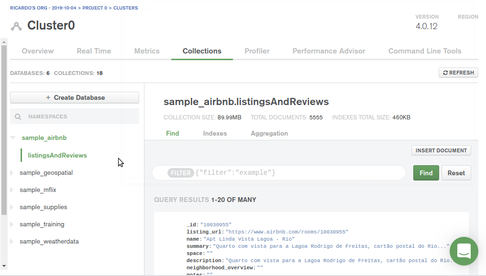
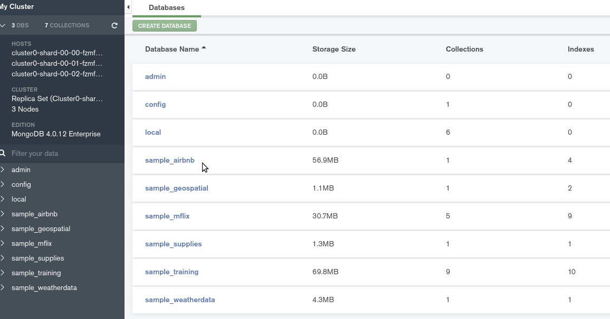
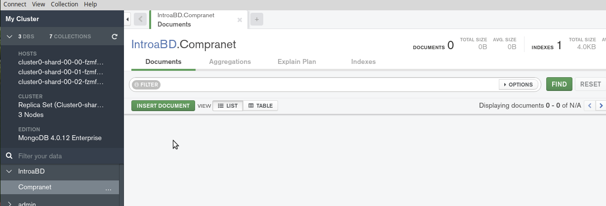
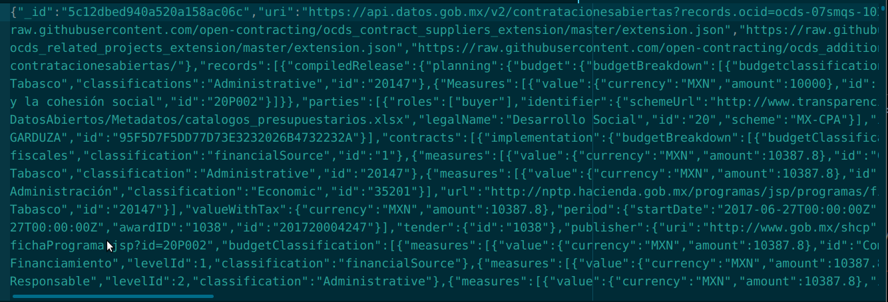
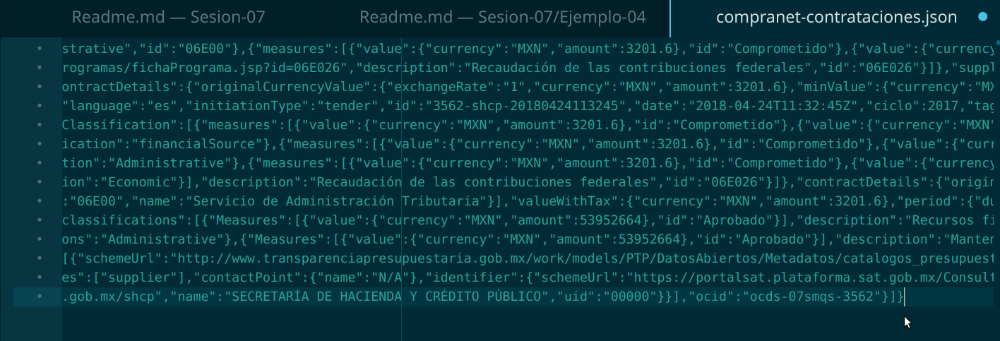
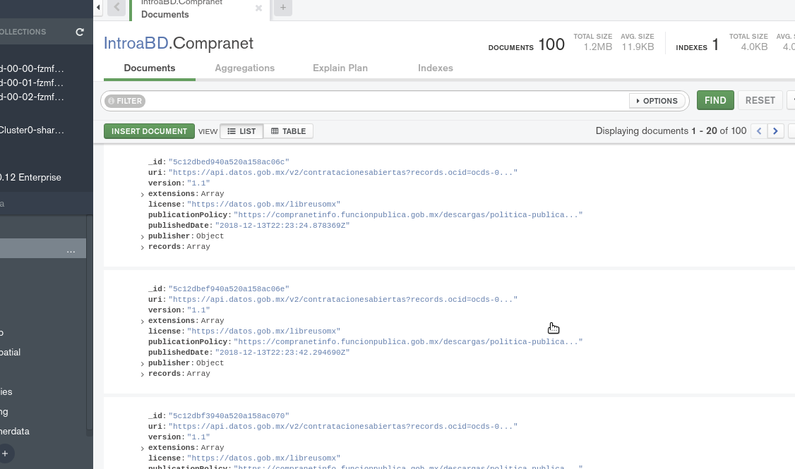

[`Fundamentos de Base de Datos`](../../Readme.md) > [`Sesión 07`](../Readme.md) > Ejemplo-04
## Creación de la base de datos e importación de datos

### OBJETIVO
- Que el alumno cree una base de datos en un Cluster de MongoDB en la nube
- Que el alumno prepare el conjunto de datos para ser importado
- Que el alumno importe un conjunto de datos

### REQUISITOS
1. Repositorio actualizado
1. Usar la carpeta de trabajo `Sesion-07/Ejemplo-04`
1. MongoDB Compass Instalado
1. Conexión a Cluster de MongoDB

### DESARROLLO
1. __MondoDB Atlas__ posee algunos conjuntos de datos de ejemplo que pueden ser usados para realizar algunas prácticas de Ciencia de Datos, para tener acceso a estos conjuntos entrar con su email y clave de registro en:

   https://cloud.mongodb.com/user?nds=true#/atlas/login

   
   Después de conectarse se observará la lista de todos los clusters, entonces en el __Cluster0__ en el botón con tres puntos dar click y luego seleccionar __Load Sample Dataset__

   
   Dar click en __Load Sample Dataset__ se iniciará la carga de los datos de ejemplo, lo que podría demorar unos 3 mins hasta ver una página como la siguiente:

   
   Ahora se puede hacer click en el botón __Collections__ para ver la lista de colecciones disponibles:

   

   Desde __MongoDB Compass__ también se puede observar las nuevas colecciones:
   

1. Ahora vamos a importar el conjunto de datos de Compranet obtenido desde el API

   Lo primero es crear la base de datos __IntroaBD__ y la colección __Compranet__ a donde importar los datos

   

   Ahora se procede a importar los datos del archivos `json/compranet-contrataciones.json` desde la opción del menú `Collection > Import Data`, donde se eleccionar el archivo y se dá click en el botón __IMPORT__

   Pero, se observa que la colección ha quedado vacía sin importar ningún dato.

   Esto es debido a que __MongoDB__ necesita que cada documento en el archivo json estén separados por una nueva línea y no deben estar contenidos en un arreglo, por lo que es necesario editar el archivo `json/compranet-contrataciones.json` realizando los siguientes ajustes:

   1. Eliminar la parte inicial del archivo:

     ```json
     {"pagination":{"pageSize":100,"page":1,"total":300265},"results":[
     ```
     El inicio del archivo se tiene que ver de la siguiente forma:
     

   1. Como los documentos formaban parte de un arreglo están separados por una coma, así que es necesario remplazar la cadena `},{"_id"` por la cadena `}\n{"_id"`, así que se hace uso de la herramienta de búsqueda y remplazo (en este caso del editor Atom y se habilita la opción de expresiones regulares)

     

   1. En la parte final del archivo se eliminan los simbolos de `]}` quedando el archivo como sigue:

     

   Se intenta importar el archivo nuevamente con __MongoDB Compass__ y el resultado es el siguiente:

   
   Se puede observar que se tienen 100 documentos importados.

__Nota:__ La carpeta `json.por-si-acaso/` contiene el archivo ya modificado para ser importado desde MongoDB y puede ser usado en caso de que el alumno no logre ajustar el archivos correctamente.
